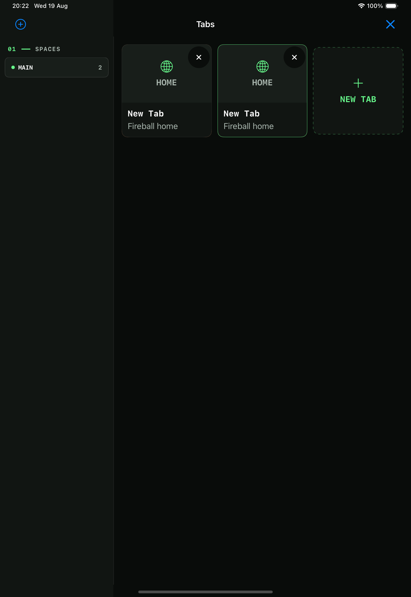
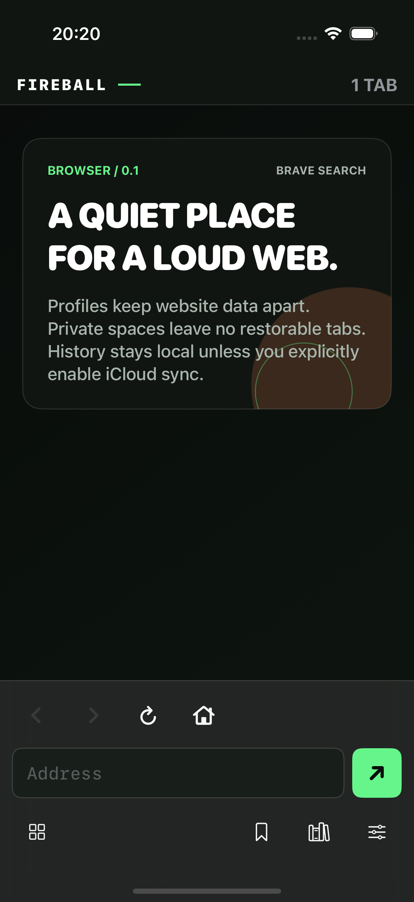
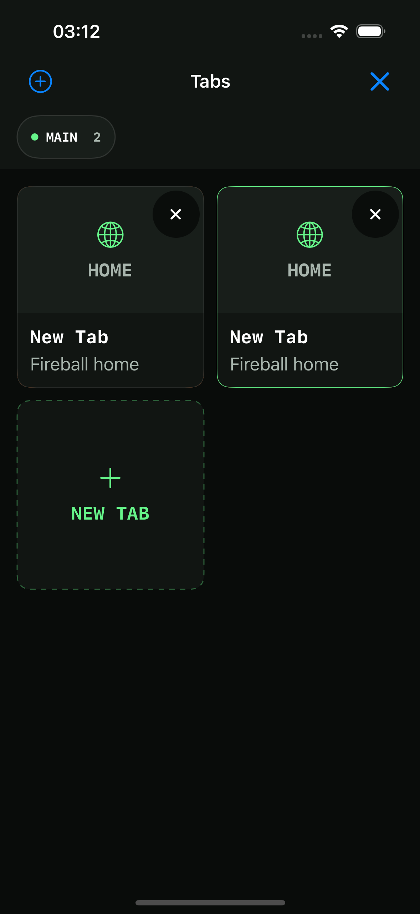
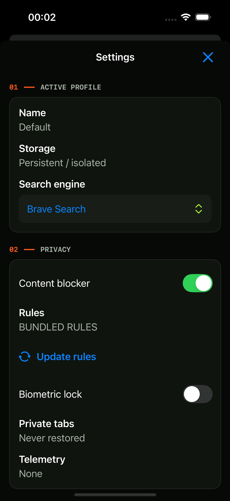
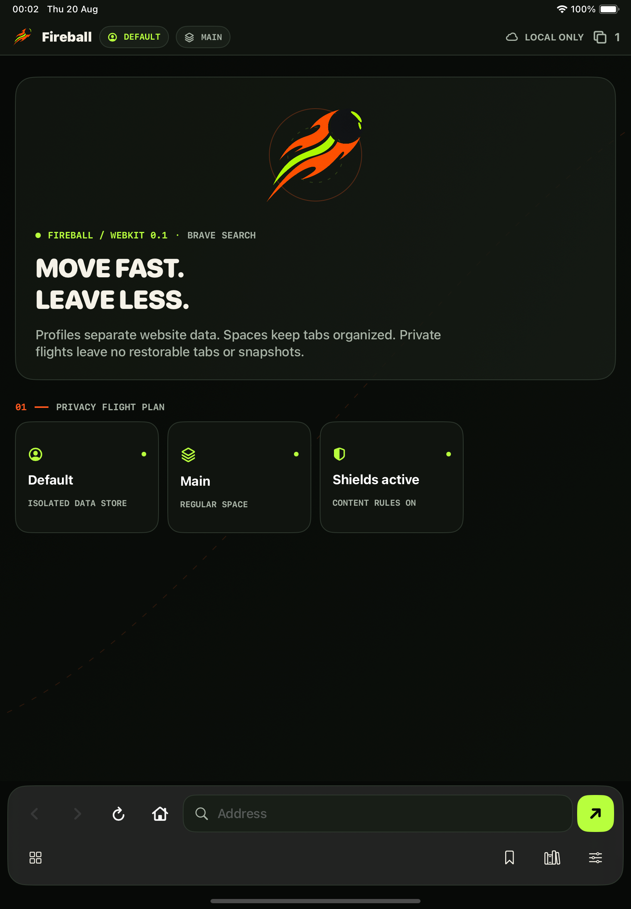
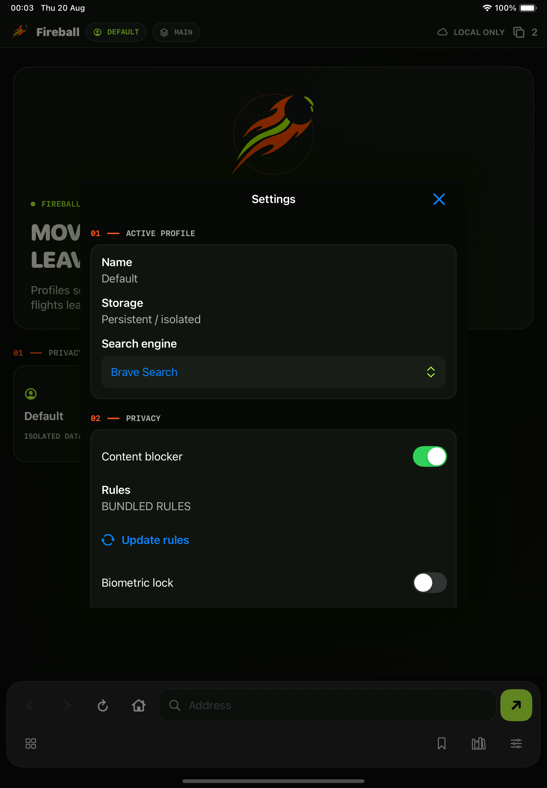
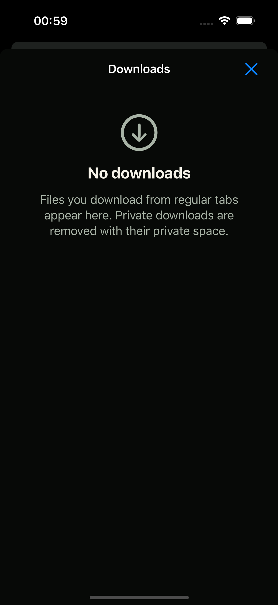
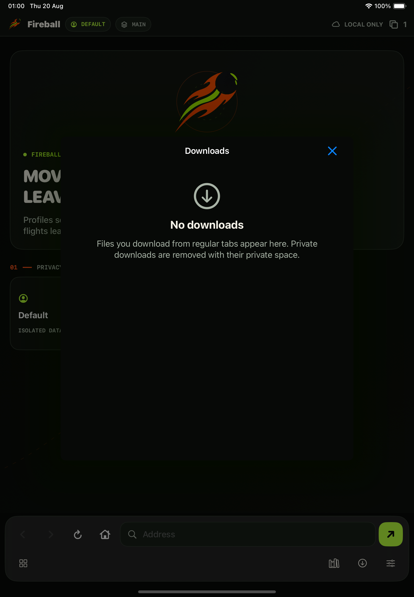

# Fireball Browser for WebKit

[](https://github.com/LamPPKK/fireball-webkit/actions/workflows/ci.yml)
[](https://developer.apple.com/ios/)
[](Release/TESTFLIGHT.md)

Fireball is a native SwiftUI browser shell around `WKWebView` for iPhone and iPad. It keeps WebKit's sandboxed process model, separates website data by profile, leaves private spaces out of restore, and ships without a telemetry SDK.


The detached meteor is the shared Fireball mark. WebKit turns that identity into
a **quiet cosmic flight deck**: native SwiftUI sheets and controls, a floating
bottom omnibox, adaptive iPad composition, Dynamic Type and 44-point-or-larger
touch targets. Product tokens and component rules are recorded in
[`design-system/fireball-webkit/MASTER.md`](design-system/fireball-webkit/MASTER.md)
and [`pages/browser-shell.md`](design-system/fireball-webkit/pages/browser-shell.md).



Marketing version `0.1.0` · Bundle identifier `com.fireball.browser` · Default search Brave Search · External TestFlight candidate

## Demo and screenshots

[▶ Watch the 12-second Simulator demo](docs/assets/fireball-demo.mp4)

| Native home | Tab grid | Privacy settings |
| --- | --- | --- |
|  |  |  |

| iPad home | Adaptive tab grid | iPad settings |
| --- | --- | --- |
|  |  |  |

| iPhone transfer deck | iPad transfer deck |
| --- | --- |
|  |  |

The eight screenshots were captured by the opt-in XCTest media flow from the
current app build on iPhone 16 and iPad (A16) iOS 18.6 Simulators; the MP4
records the same browser flow separately. These files are documentation evidence,
not a substitute for physical-device or TestFlight acceptance.

## What is implemented

### Profiles, spaces, and tabs

- Stable UUIDs for profiles, spaces, tabs, archived tabs, bookmarks, and history visits.
- A profile owns one persistent `WKWebsiteDataStore(forIdentifier:)`; multiple spaces may share that profile.
- A private space uses `WKWebsiteDataStore.nonPersistent()` and never persists tabs, history, or snapshots.
- Adaptive iPhone tab grid and iPad sidebar/grid, swipe-to-close, popup-to-tab handling, native home, bookmarks, and history.
- Arc-style pinned tabs sort ahead of regular tabs and are protected from automatic Archive. Pin state follows the tab through regular persistence and iCloud metadata sync; private pin state remains memory-only.
- Arc-inspired Archive: closing a regular web tab keeps bounded URL/title metadata for 30 days (up to 200 entries per profile), with one-tap restore from Library. Automatic Archive can be disabled or set to 1, 7, or 30 inactive days; active, pinned, Home, and private tabs are never moved automatically.
- Regular tab restoration after relaunch and LRU release of background WebViews under memory pressure.

### Browsing and resilience

- Bottom omnibox with Brave Search by default and DuckDuckGo, Google, or Bing per profile.
- Back, Forward, Reload, Home, bookmarks managed from Library, native URL sharing, and focused-scene iPad keyboard commands.
- URL policy admits HTTP and HTTPS while Apple Transport Security remains enforced. `mailto:` and `tel:` require confirmation; script, data, file, and custom schemes are blocked.
- If WebKit terminates the active content process, Fireball retries once. A repeated failure stops the loop and offers explicit Reload or Open Home recovery for that exact tab. A terminated background session is discarded and recreated only when needed.

### Downloads

- Native `WKDownload` handling for HTTP(S) and page-scoped `blob:` download links, `Content-Disposition: attachment`, and MIME types WebKit cannot display.
- A Fireball transfer tray shows live system progress and supports pause, resume when the server supplies resume data, native sharing, and deletion.
- Regular files live in `Fireball Downloads`, remain visible after relaunch, and are exposed through the iOS Files integration. Filename normalization and collision suffixes keep destinations inside that directory.
- Private downloads use a cache-only directory, never enter browser persistence or CloudKit, and are removed when their private space closes or Fireball next launches.
- Media-link discovery and BitTorrent are desktop Blink workstreams; this WebKit beta does not claim either feature.

### Privacy and sync

- Private CloudKit metadata sync through `NSPersistentCloudKitContainer` with a local replica, last-writer-wins UUID conflict handling, and 30-day tombstones.
- Profiles, spaces, regular tabs, regular-tab Archive metadata, bookmarks, settings, and exact-host Shields exceptions may sync; cookies, cache, credentials, biometric state, snapshots, private tabs, and private-space exceptions never do.
- Profile deletion commits its synced metadata tombstone before destructive work. Each device then uses a local-only retry ledger to remove that profile's `WKWebsiteDataStore` and Keychain lock on launch/foreground, including after an offline device later receives the tombstone; cleanup progress, cookies, cache, and lock material never enter CloudKit.
- History sync is opt-in, disclosed before enabling, and limited to 90 days.
- Per-profile signed content-blocker policy with last-known-good rollback and a Shields control in the omnibox. Site exceptions match only the exact hostname, remain isolated by profile, and apply on the next navigation or explicit reload so Fireball never destroys a form or media session without the user's action.
- Optional profile lock through Keychain and LocalAuthentication, private-space foreground lock, and an app-switcher privacy cover.
- No proprietary telemetry SDK and no default analytics upload.

### Accessibility

- 48-point minimum controls, Dynamic Type-aware layouts, VoiceOver labels and actions, and iPad hardware-keyboard navigation.
- Automated accessibility audits cover browser chrome, tab grid, library, and settings on iPhone and iPad Simulator lanes.

## Midori reference audit

The latest GitHub state of [`midori-android`](https://github.com/LamPPKK/midori-android) and [`midori-core`](https://github.com/LamPPKK/midori-core) was reviewed as reference material, not copied as implementation instructions.

This pass adopted two compatible ideas: native URL sharing and explicit WebKit content-process recovery. It did not import Firefox Sync/password-vault code, the iOS 26 `WebPage` API, Android System WebView/WPE adapters, or the portable-backup format into the 0.1 beta.

The exact source commits, decision ledger, and post-beta candidates are recorded in [the Midori reference audit](docs/MIDORI_REFERENCE.md).

## Build and test

Requirements:

- macOS with Xcode 16 or newer and an iOS 18+ Simulator runtime.
- [XcodeGen](https://github.com/yonaskolb/XcodeGen) 2.46 or newer.
- Python 3 for release and blocker tooling tests.

```sh
xcodegen generate

FIREBALL_IPHONE_UDID="$(DEVELOPER_DIR=/Applications/Xcode.app/Contents/Developer \
  python3 Tools/select_simulator.py --family iphone)"

DEVELOPER_DIR=/Applications/Xcode.app/Contents/Developer \
  xcodebuild test \
  -project FireballWebKit.xcodeproj \
  -scheme FireballWebKit \
  -destination "platform=iOS Simulator,id=$FIREBALL_IPHONE_UDID" \
  CODE_SIGNING_ALLOWED=NO

python3 -m unittest discover -s Tools/tests
```

Debug and CI builds keep CloudKit and remote blocker downloads disabled so unsigned Simulator tests remain deterministic. Release builds enable both through generated Info.plist flags.

## Blocker releases

`Blocker/sources.json` pins EasyList and EasyPrivacy to exact upstream commits. `Tools/build_blocker.py` converts the supported network-rule subset and emits an unsupported-rule report. The protected `blocker-rules` workflow verifies the Ed25519 key pair, signs the canonical manifest, and publishes immutable source and artifact provenance.

Required protected secrets:

- `BLOCKER_SIGNING_KEY_BASE64`
- `BLOCKER_PUBLIC_KEY_BASE64`

EasyList, EasyPrivacy, and derived artifacts retain GPL-3.0-or-later attribution. See [Blocker/README.md](Blocker/README.md).

## External TestFlight gate

The protected `testflight` environment requires:

- `APPLE_TEAM_ID`, `APP_STORE_CONNECT_KEY_ID`, `APP_STORE_CONNECT_ISSUER_ID`, `APP_STORE_CONNECT_PRIVATE_KEY`, and `BLOCKER_PUBLIC_KEY_BASE64`;
- `CLOUDKIT_SCHEMA_PROMOTED=true` only after the development schema is promoted to production;
- manual approval before archive and upload.

Release CI archives once, verifies the signature and production entitlements,
exports exactly one safe-named regular IPA, inspects it, records its SHA-256
checksum, validates it with App Store Connect, and uploads that same path only
after rechecking the checksum. A successful upload also emits a strict
[`release-evidence-v1.json`](Release/evidence-v1.schema.json) candidate that
binds the IPA digest and size to the exact commit, workflow run, attempt, build
number, validation result, and upload result. Candidate creation must rehash the
IPA after upload and match both the digest and size locked before upload. The v1
record always remains `candidate`; it never infers App Store processing or Beta
App Review. The JSON Schema is structural, while the executable validator and
[published invariant corpus](Release/evidence-v1.invariants.md) are normative
for cross-field identity. This is a consistency record, not a standalone
cryptographic attestation; trust it only with the referenced protected workflow
artifact and separate Apple-side processing/review evidence.

External Beta App Review, two-device iCloud isolation, physical-device accessibility, IPv6-only, memory-pressure, and stability checks remain release gates. Follow [Release/TESTFLIGHT.md](Release/TESTFLIGHT.md) and attach evidence to the exact uploaded IPA.

Fireball Blink remains frozen until this gate passes. XanhTab and `fireball-docker` remain outside this roadmap except for urgent security fixes.

## Repository map

| Path | Responsibility |
| --- | --- |
| `App/` | SwiftUI shell, adaptive surfaces, commands, and app lifecycle |
| `Sources/Browser/` | `WKWebView` sessions, navigation, native downloads, blocker application, recovery, and coordination |
| `Sources/Domain/` | Stable browser models, URL policy, and session restoration |
| `Sources/Persistence/` | Core Data and private CloudKit metadata replica |
| `Sources/Security/` | Keychain and LocalAuthentication boundaries |
| `Blocker/` | Signed blocker manifest schema, provenance, and bundled rules |
| `Tests/`, `UITests/` | Unit, integration, accessibility, and documentation-media tests |
| `Tools/` | Blocker, release, entitlement, IPA, and Simulator verification tools |
| `docs/` | GitHub Pages, screenshots, demo, and architecture notes |
